# Introduction

Welcome to Intro to Git! This guide will help you learn how to use Git by installing the appropriate version and pushing your code to the repository. Git is a version control system used for software development and GitHub is an internet hosting service that provides access control, bug tracking, task management, and other features for Git projects.

## Intended Users

This documentation is targeted towards the following Users:

- Beginner developers who are using Git and are using Git to push their code into the repository.

## Software Requirements

Before proceeding, ensure that you have the following requirements installed:

- [GitHub Account](https://github.com/)
- [Visual Studio Code](https://code.visualstudio.com/download)

## Procedure Overview

The main section of the documentation are summarized below.

- [Git Basics](Gitbasics.md)
- [Pushing Code With Git](Pushingcodewithgit.md)
- [Working with Branches](Workingwithbranches.md)
- [Versions Control](Versioncontrol.md)
- [Trouble Shooting](TroubleShooting.md)

## Notes and Warning Messages

Throughout the documentation, we will use message blocks to inform you of relevant information. Each possible message block, from most important to least important:

!!! warning
    Specifies content that must read before proceeding.

!!! info
    Indicates additional important information and tips.

!!! success
    Indicates what success looks like.

## Installing Git

Here are some examples of how to install Git using Linux, MacOS and Windows.

### Linux Users

We have provided the following installation commands for some of the most popular Linux distributions:

**Ubuntu**

```text
sudo apt install git
```

**Arch**

```text
sudo pacman install git
```

**Fedora** / **Red Hat**

```text
sudo dnf install git
```

### MacOS Users

First, install Homebrew if you havent already installed. Click [here](https://brew.sh/)

Then, run :

```
brew install git 

```

inside yout terminal

### Windows Users

For Windows users, vist the following Web page and download Git: Click [here](https://git-scm.com/download/win)

 and click the 64-bit for Windows setup.

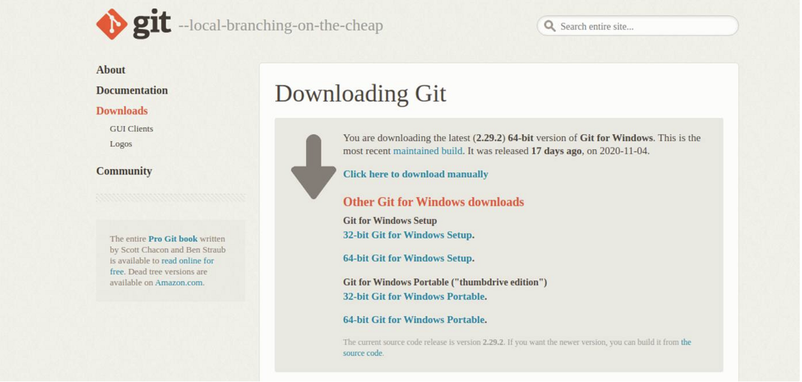{width=800px}


1\. Click, yes if the following pop-up window pops up
   

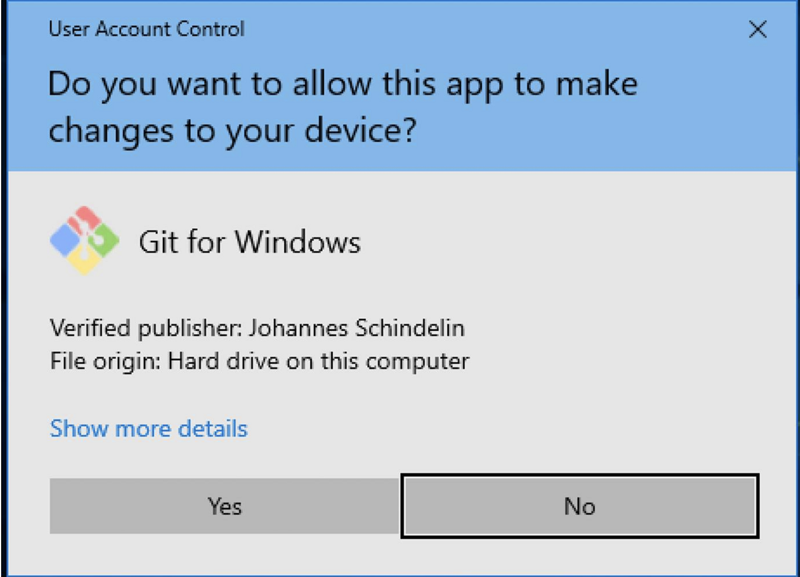{width=800px}

2\. Choose next for all the prompt 

Choose next for all the prompt

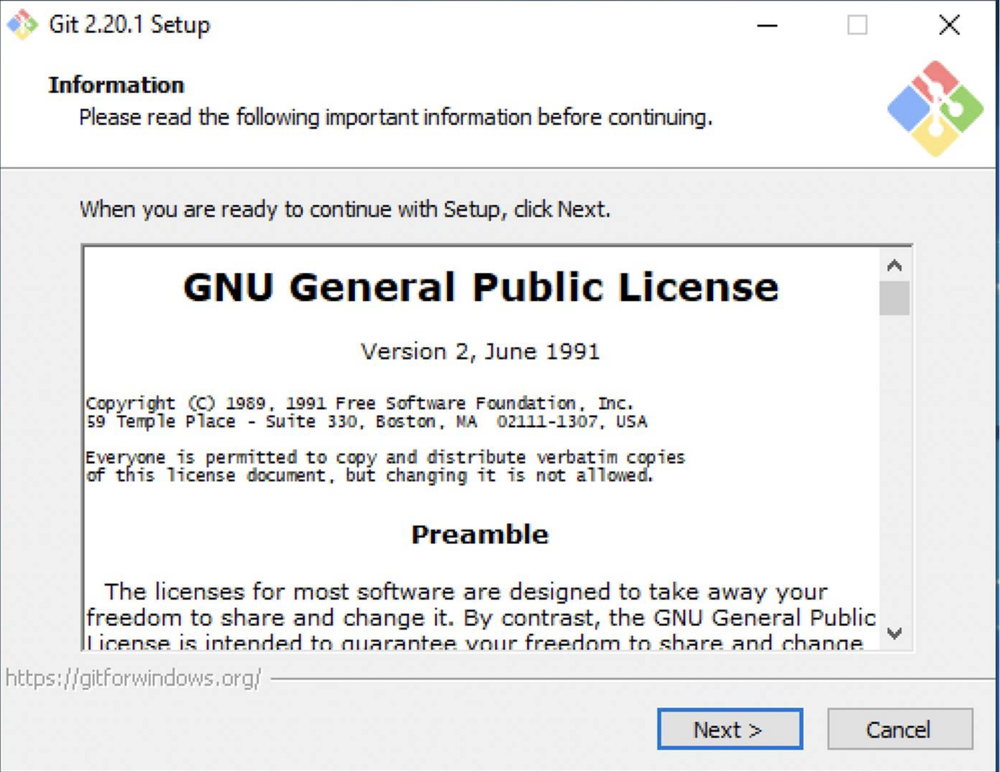{ width=800px }

3\. Click the dropdown button to select Visual Studio Code. Otherwize, select the default setting which is Vim

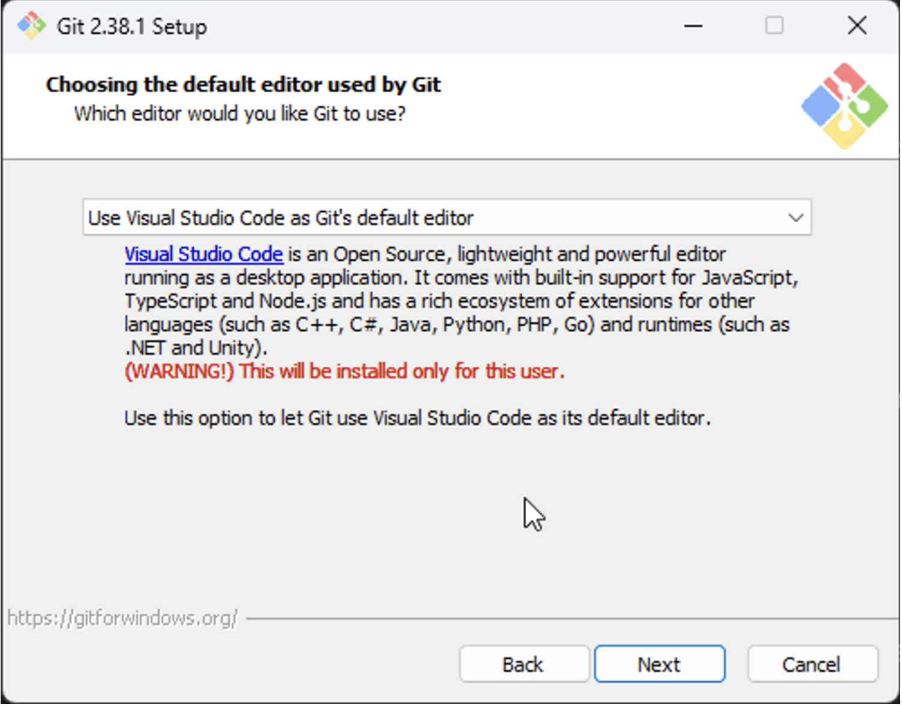{ width=800px }


4\. Select Git from the command line and also from third party software and keep it that way.
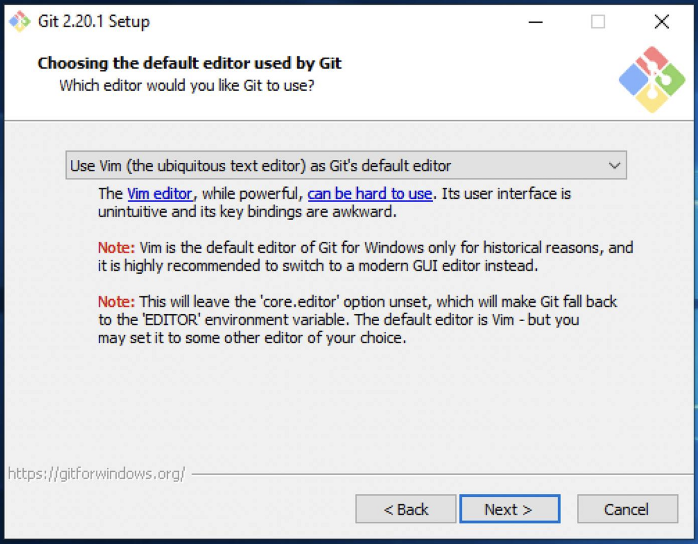{ width=800px }

5\. Use bundled OpenSSH and Use the OpenSSL library should be the defaults. Keep it that way.

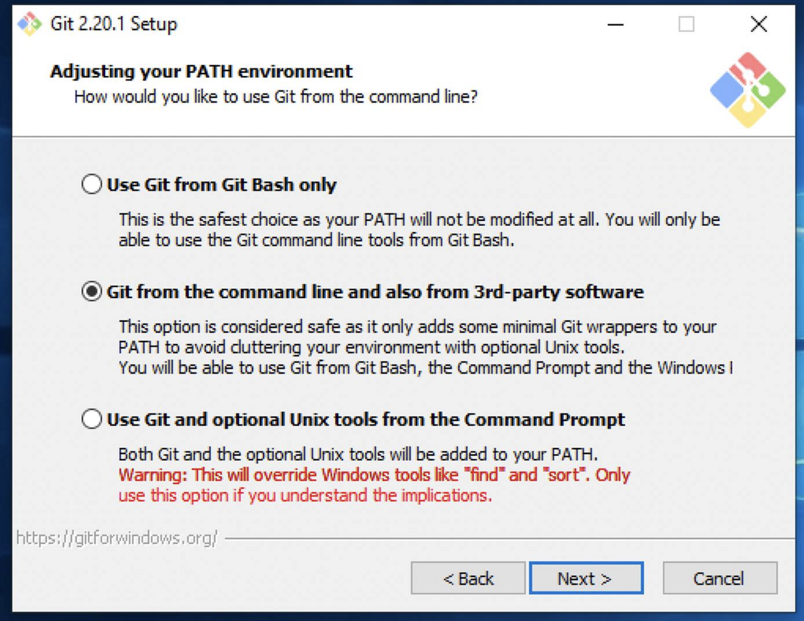{ width=800px }

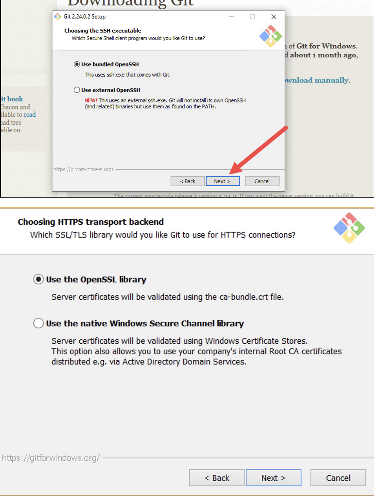{ width=800px }

6\. Select Checkout Windows-style should be default. Keep it that way.

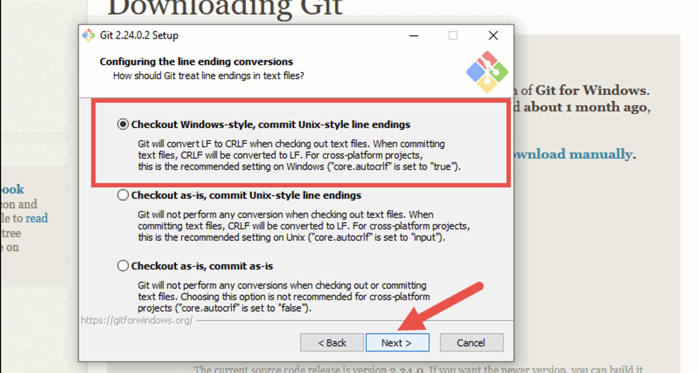{ width=800px }

7\. Choose the terminal emulator: Leave it at the default which is Use MinTTY

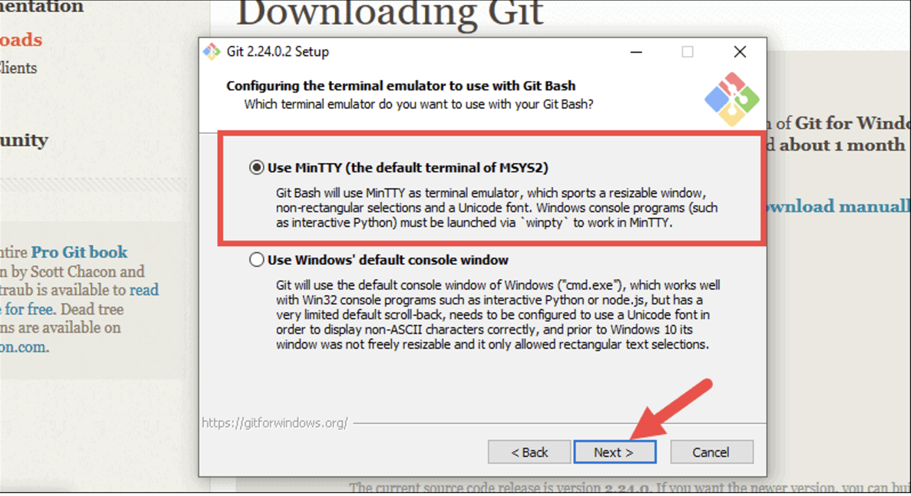{ width=800px }

8\. Select the default git pull option checked

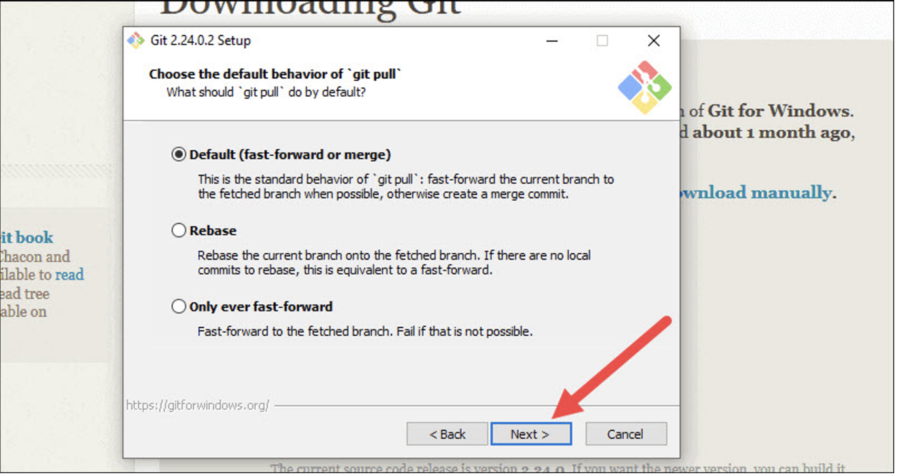{ width=800px }

9\. Select the default Git Credential Manager Core.

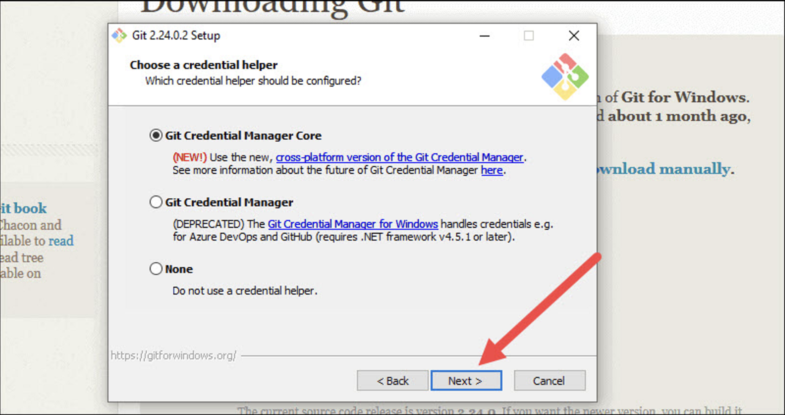{ width=800px }

10\. You should be done installing Git. To check if Git is installed, go to your start menu and typeinside the terminal. You should see the Git icon logo which is shown in the screenshot.

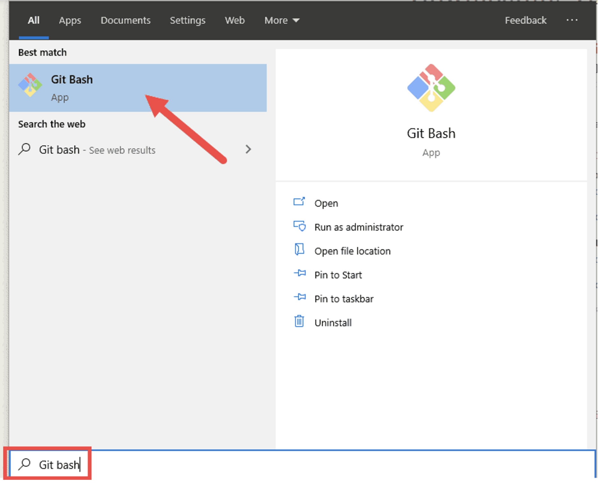{ width=800px }

```
Git bash

```

11\. Inside the terminal type this command, this will display the current version of Git


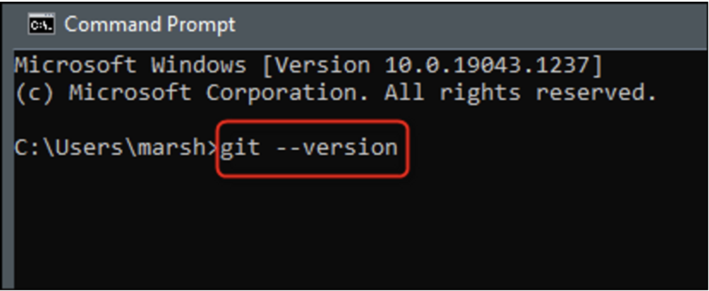{ width=800px }

```
git --version

```

Once you have the latest version of Git, you are ready to learn the Git Basics commands.

# Conclusion

By the end of this section, you will have successfully learned the following:

- [x] Learn what is Git about
- [x] How to install Git into your environment

Congratulations! 🎉 Go on to the next section to learn more about how to use Git Basic commands.
Click the link below:

[Git Basics](Gitbasics.md)
